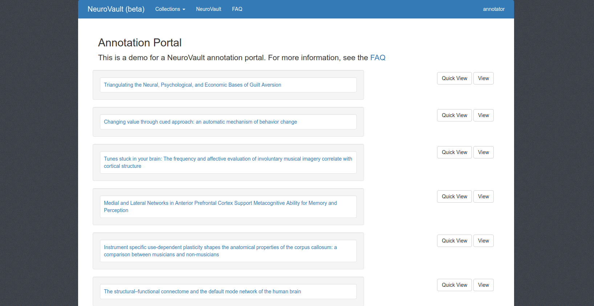

# NeuroVault Annotation Portal 

This was an old application to bring hypothes.is annotation to neuroVault.



The demo is taken down, but can be built locally (and run) with a container.

```bash
$ docker build -t vanessa/flask-neurovault-annotation .
```

Or to run directly from Docker Hub:

```bash
$ docker run -p 5000:5000 vanessa/flask-neurovault-annotation
```
